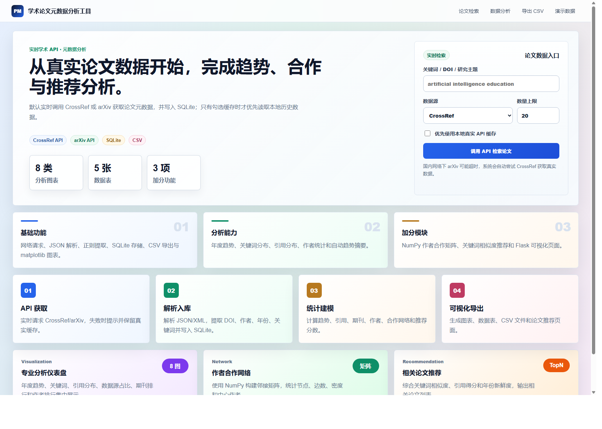
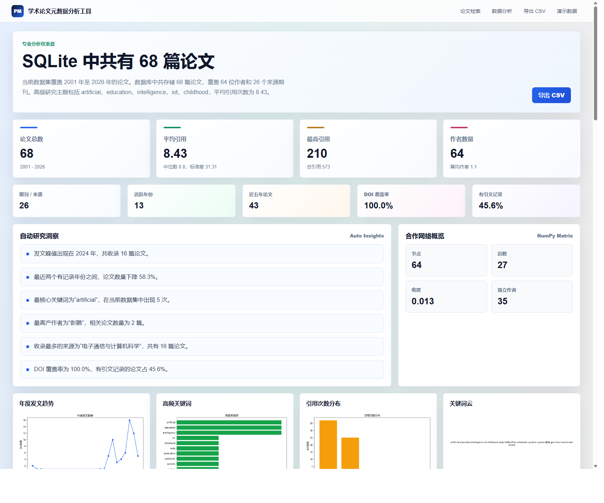

# 学术论文元数据分析工具

## 一、项目介绍

本项目是 Python 课程大作业“学术论文元数据分析工具”。系统可以通过 OpenAlex、CrossRef 和 arXiv 学术 API 获取真实论文元数据，完成论文检索、数据清洗、SQLite 存储、统计分析、可视化展示、CSV 导出和相关论文推荐。

项目重点覆盖网络请求、JSON/XML 解析、正则表达式、函数模块化、SQLite 数据库、文件导出、matplotlib 可视化、NumPy 合作网络分析和 Flask Web 页面等课程要求。

## 二、主要功能

- 论文检索：输入关键词、DOI 或研究主题，实时调用 OpenAlex/CrossRef/arXiv API 获取论文数据，并按关键词相关性、引用次数和年份重排结果。
- 元数据解析：提取标题、作者、年份、DOI、期刊、引用次数、摘要、URL 等字段。
- 正则提取：使用正则表达式提取 DOI、年份和关键词。
- 数据库存储：使用 SQLite 保存论文、作者、关键词及关联关系。
- 数据分析：围绕本次关键词检索返回的论文集合，统计年度趋势、关键词频率、引用分布、期刊排行、作者排行和数据源占比。
- 专业指标：计算相关性分数、综合排序分、平均引用、中位引用、引用标准差、DOI 覆盖率、近五年论文数和高被引论文排行。
- 合作网络：使用 NumPy 构建作者合作邻接矩阵，分析合作边数、网络密度和作者中心度。
- 论文推荐：基于关键词相似度、引用得分和年份新鲜度推荐相关论文。
- 文件导出：将本次检索结果导出为 CSV 文件。
- Web 展示：使用 Flask 提供论文检索、结果展示、分析仪表盘和推荐页面。

## 三、安装与运行方式

### 1. 进入项目目录

```powershell
cd paper_metadata_analyzer
```

### 2. 安装依赖

```powershell
pip install -r requirements.txt
```

### 3. 启动项目

```powershell
python app.py
```

### 4. 打开浏览器访问

```text
http://127.0.0.1:5005
```

如果 5000 端口被占用，可以在 PowerShell 中指定其他端口：

```powershell
$env:PORT=5004
python app.py
```

论文检索默认实时调用远程学术 API。OpenAlex 会返回更完整的 `cited_by_count` 引用次数，CrossRef 会同时获取相关候选并补充 OpenAlex 高引用候选，再在本地按关键词相关性、引用次数和年份综合排序；arXiv 通常不提供引用次数，因此 arXiv 结果的引用数可能为 0。若 OpenAlex 或 arXiv 网络超时，系统会自动尝试 CrossRef；若远程 API 不可用，则优先显示本地真实缓存，不会把演示数据伪装成检索结果。需要离线展示时，可点击页面中的“演示数据”。

## 四、功能截图

### 1. 论文检索首页



### 2. 真实 API 检索结果


### 3. 数据分析仪表盘



## 五、项目结构

```text
paper_metadata_analyzer/
├─ app.py                  # Flask 主程序与路由
├─ config.py               # 路径、API 地址和默认参数配置
├─ requirements.txt        # 第三方依赖
├─ README.md               # 项目说明文档
├─ data/
│  └─ papers.db            # SQLite 数据库，运行后自动生成
├─ exports/
│  └─ papers.csv           # CSV 导出文件，运行后自动生成
├─ docs/
│  └─ screenshots/         # README 功能截图
├─ static/
│  ├─ css/style.css        # 页面样式
│  └─ charts/              # matplotlib 生成的图表
├─ templates/              # Flask HTML 模板
└─ src/
   ├─ api_client.py        # OpenAlex/CrossRef/arXiv API 请求
   ├─ parser.py            # JSON/XML 响应解析
   ├─ extractor.py         # 正则提取与关键词处理
   ├─ database.py          # SQLite 数据库操作
   ├─ analyzer.py          # 统计分析与自动洞察
   ├─ network.py           # NumPy 作者合作网络
   ├─ recommender.py       # 相关论文推荐
   ├─ visualizer.py        # matplotlib 可视化
   └─ exporter.py          # CSV 导出
```

## 六、评分点对应

| 评分要求 | 项目实现 |
|---|---|
| 网络编程：调用学术 API 获取论文数据 | `src/api_client.py` 调用 OpenAlex、CrossRef 和 arXiv |
| 字典/列表解析嵌套 JSON 响应 | `src/parser.py` 解析 OpenAlex/CrossRef 返回的 JSON |
| 正则表达式提取 DOI、年份、关键词 | `src/extractor.py` 使用正则表达式处理文本 |
| 函数模块化设计数据获取和分析流程 | `src/` 下按功能拆分多个模块 |
| SQLite 存储论文元数据 | `src/database.py` 创建论文、作者、关键词及关系表 |
| 文件操作：导出分析结果为 CSV | `src/exporter.py` 导出 `exports/papers.csv` |
| matplotlib 可视化发表趋势、关键词云 | `src/visualizer.py` 生成趋势图、关键词图、词云等 |
| NumPy 统计分析引用网络、合著关系 | `src/network.py` 构建作者合作邻接矩阵 |
| 基于关键词重合度的相关论文推荐 | `src/recommender.py` 计算综合推荐分数 |
| Flask 构建论文搜索与可视化 Web 页面 | `app.py` 和 `templates/` 提供 Web 界面 |

## 七、代码风格与注释说明

- 代码按功能拆分为独立模块，避免所有逻辑堆在一个文件中。
- 函数命名使用清晰的英文动词短语，例如 `fetch_crossref`、`parse_crossref_response`、`analyze_papers`。
- 数据库、API、分析、推荐、可视化和导出逻辑分别放在不同文件中，便于阅读和维护。
- 对复杂逻辑保留了必要注释或清晰函数名，例如 API 重试、SQLite 建表、作者合作矩阵、推荐评分等。
- 页面模板和样式文件分离，HTML 模板只负责结构，CSS 负责视觉表现。
- 使用 `compileall` 进行语法检查，保证代码能够正常导入和运行。

## 八、推荐演示流程

1. 启动应用并进入首页。
2. 输入关键词，例如 `artificial intelligence education`。
3. 选择 OpenAlex，点击“调用 API 检索论文”。
4. 查看真实 API 返回的论文结果和数据来源标识。
5. 点击某篇论文的“推荐相关论文”，展示推荐功能。
6. 点击“分析本次结果”，展示当前关键词 API 数据对应的核心指标、自动洞察、图表和高被引论文。
7. 点击“导出本次 CSV”，展示当前检索结果的文件导出功能。
8. 网络不稳定时，可点击“演示数据”进行离线展示。
